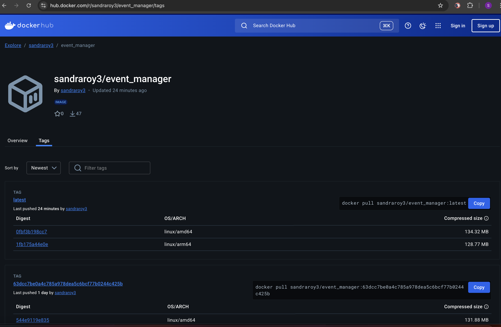

# [My github repository](https://github.com/sandraroy3/event_manager)

This Readme tracks known issues identified during the development and testing of the HW 10 project - Event Manager, along with their corresponding solutions and what I learnt.

# Issues and solution

[Issue 4](https://github.com/sandraroy3/event_manager/issues/4)
Email validation - involve handling special characters, enforcing length constraints, or ensuring uniqueness
Solution: added Email validation logic to ensure email addresses are valid and unique.

[Issue 6](https://github.com/sandraroy3/event_manager/issues/6)
Password validation follows security best practices, such as enforcing minimum length, requiring complexity (e.g., a mix of uppercase, lowercase, numbers, and special characters), and properly hashing passwords before storing them in the database.
Solution: added Password validation logic to ensure passwords meet security requirements.
def validate_password_complexity(password: str):
    password_pattern = r"^(?=.*[A-Z])(?=.*[a-z])(?=.*\d)(?=.*[!@#$%^&*(),.?\":{}|<>]).{8,}$"  # Regex pattern for password
    if not re.match(password_pattern, password):
        raise ValueError(
            "Password must be at least 8 characters long, contain at least one uppercase letter, "
            "one lowercase letter, one number, and one special character."
        )
    return password

[Issue 7](https://github.com/sandraroy3/event_manager/issues/7)
Email fix - with SMTP

[Issue 8](https://github.com/sandraroy3/event_manager/issues/8)
Admin or manager role missing #8

[Issue 9](https://github.com/sandraroy3/event_manager/issues/9)
Fix tests

# [DockerHub Deployment](https://hub.docker.com/repository/docker/sandraroy3/event_manager)

- Dockerhub Image - https://hub.docker.com/r/sandraroy3/event_manager

# Reflection on Learning

This project deepened my expertise in backend REST API development, testing, and debugging using FastAPI, PostgreSQL, and Docker. I gained advanced proficiency in request validation with Pydantic, asynchronous database operations using SQLAlchemy, and implementing JWT-based authentication. Additionally, I configured custom OpenAPI documentation to enhance Swagger UI usability, particularly for token-based workflows.

From a quality assurance perspective, I strengthened my skills in writing comprehensive automated tests with Pytest, documenting issues in GitHub, and validating application behavior through both manual and programmatic testing. I developed a stronger appreciation for edge case coverage, including enforcing unique email constraints and field-level validations. The project also improved my familiarity with DevOps practices, including Docker usage and Git workflows such as branching strategies, pull requests, and version control.

There were also some challenges where some tests broke while fixing one, Figuring out that SMTP is being used for email service, running into 401 errors, understanding big picture of code to see working parts. 

Overall, this assignment refined both my technical capabilities and my collaborative approach, equipping me to contribute effectively to real-world software development and QA teams.
